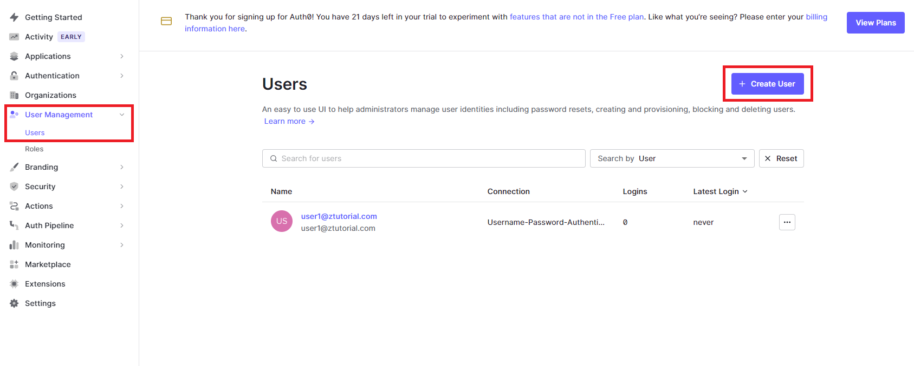
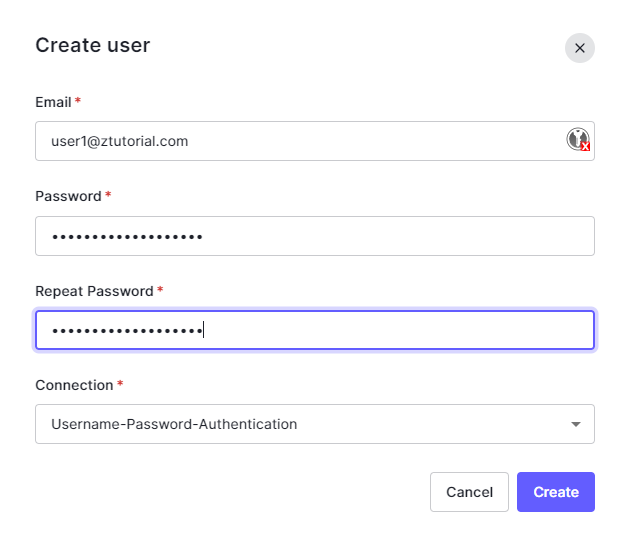
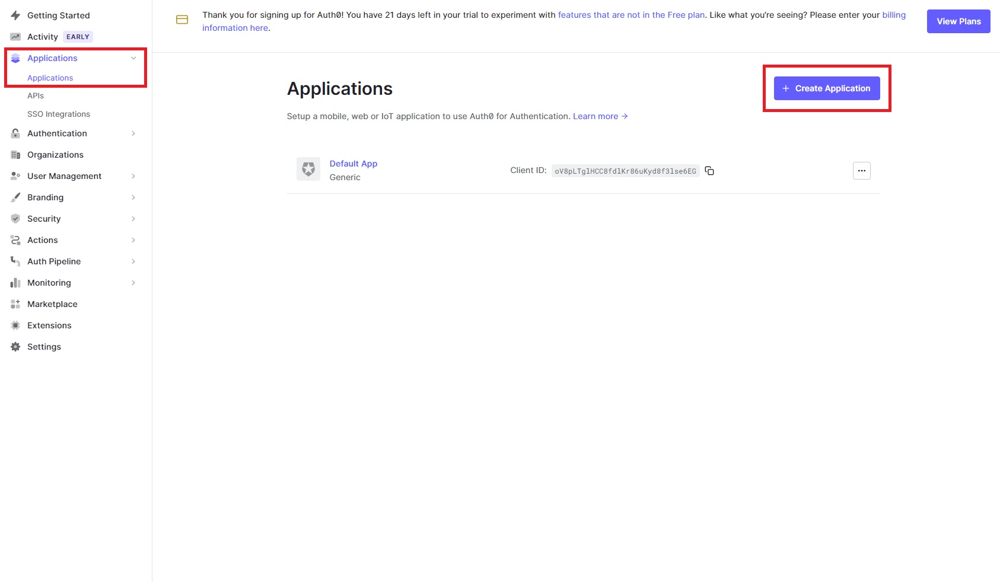
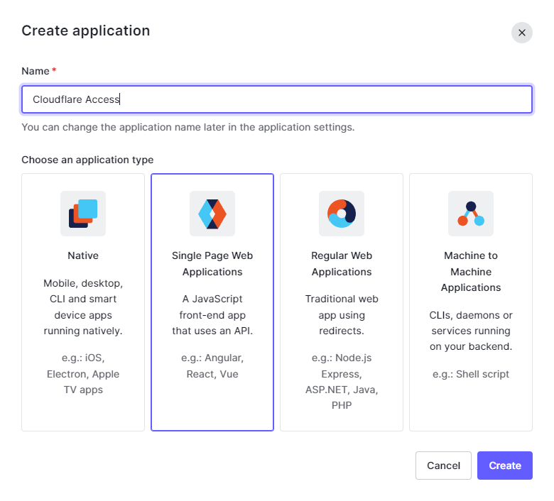
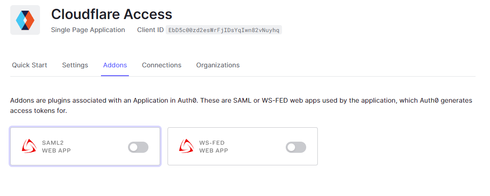
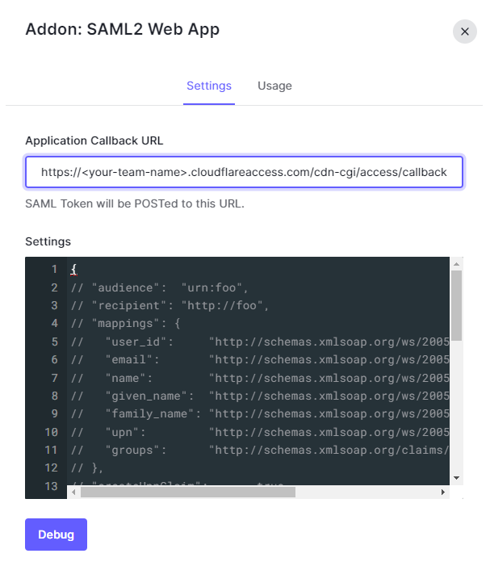
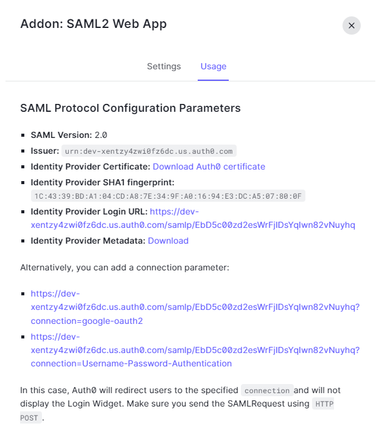
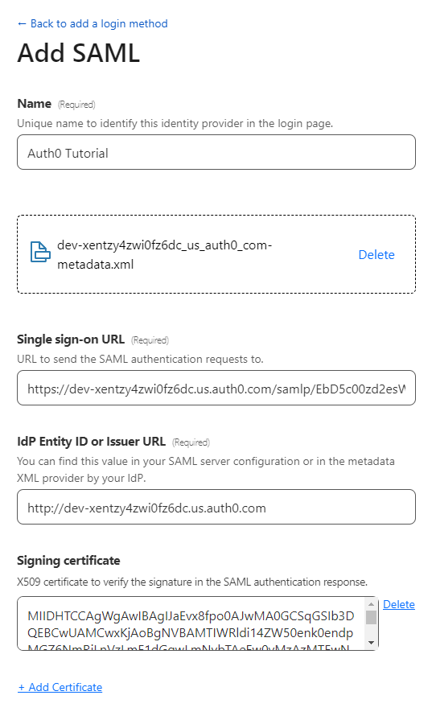
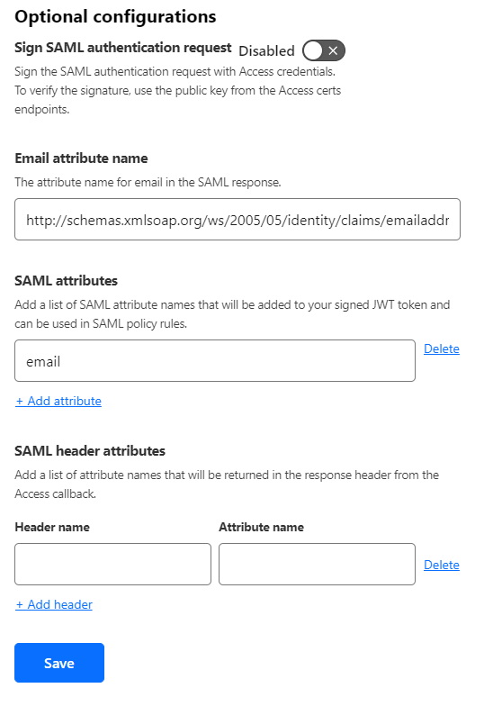
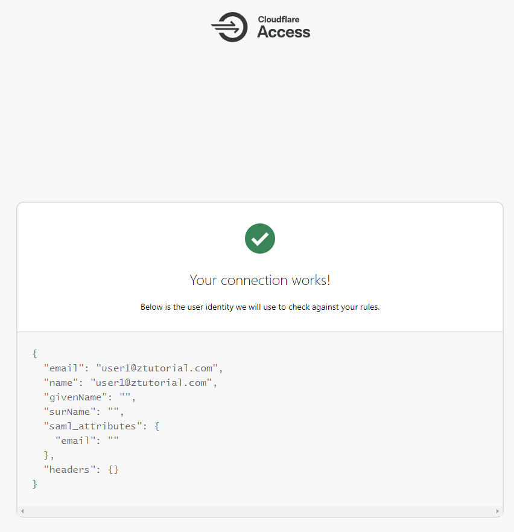

# Auth0 SAML Cloudflare Zero trust

1. Sign up Auth0 (https://auth0.com/signup)

2. Create User

3. Create an Application → Applications > Applications

4. Give it a name eg. Cloudflare Access and select **Single Page Web Application**

Addon SAML2 Web App → Under this Application > Addons > **Select SAML2 WEB APP**

Select **Settings** \
Under **Application Callback URL** input  https://<your-team-name>.cloudflareaccess.com/cdn-cgi/access/callback \ 
Scroll down and and click on **Enable**
<your-team-name> can be found under **Cloudflare Zero Trust > Setting > General Settings** 

5. In this Addon screen, you can get SAML Configuration Parameters for Cloudflare ZT dashboard \
   1. Download Auth0 certificate & Metadata
   2. Take down of Issuer & Identity Provider Login URL

# Configure Cloudflare Zero Trust dashboard

1. Login to your Zero Trust  Dashboard
2. Go to Settings > Authentication
3. On **Login methods** section, Click **Add new** > Click **SAML**

1. In Email attribute name, fill in this 👇
    
    [http://schemas.xmlsoap.org/ws/2005/05/identity/claims/emailaddress] \ 
    (http://schemas.xmlsoap.org/ws/2005/05/identity/claims/emailaddress)

Once done click on test, you can see this result below

